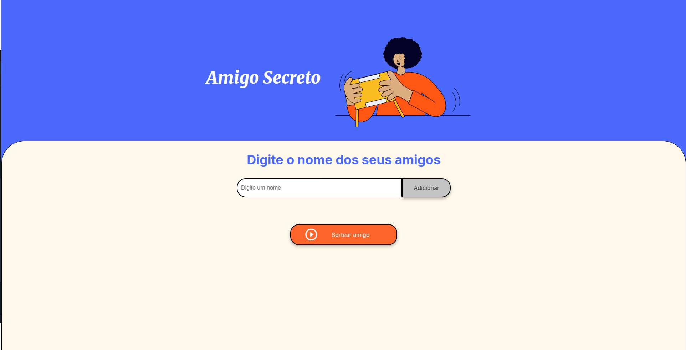
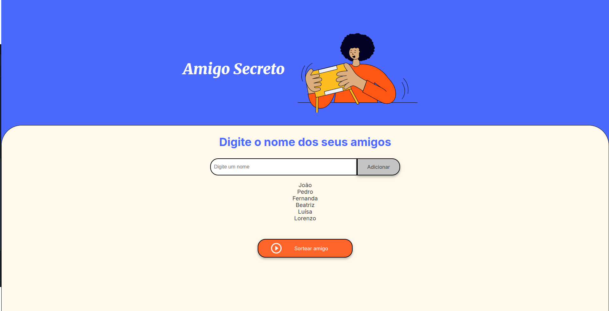
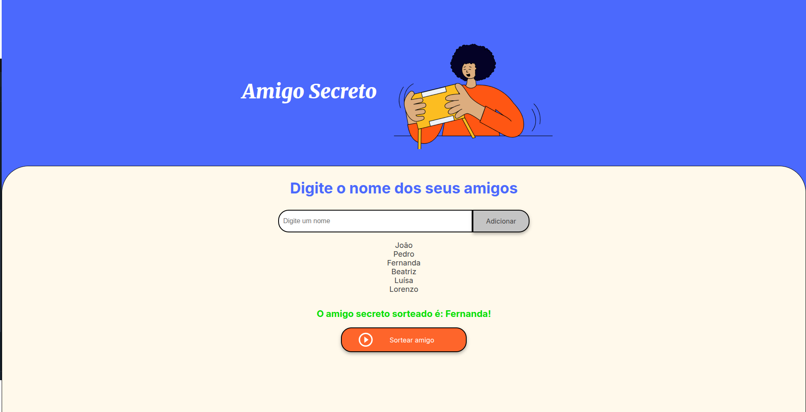

# Challenge Amigo Secreto

## ℹ️ Sobre
Projeto desenvolvido em HTML, CSS e JavaScript, cujo desafio é adicionar amigos e após isso sortear um amigo secreto.

## ⚙️ Configuração
Para rodar o projeto siga as instruções a seguir:

1 - Instale a extensão [Live Server](https://marketplace.visualstudio.com/items?itemName=ritwickdey.LiveServer) em seu Visual Studio Code;

2 - Clique com o botão direito do mouse no arquivo index.html e em seguida escolha a opção abrir com live server;

3 - Pronto será aberto uma aba no seu navegador com o projeto amigo secreto e você já poderá usá-lo.

## 🛠️ Tecnologias

  
  
  

## 📲 Funcionalidades
- [ x ] **Adicionar Amigos**
- [ x ] **Sortear Amigo Secreto**

## 📸 Telas
- **Inicial**

- **Adicionar Amigos**

- **Sortear Amigo Secreto**

---

&copy; Desenvolvido por <a href="https://www.linkedin.com/in/alissonromaosantos" target="_blank">Alisson Romão Santos</a>

